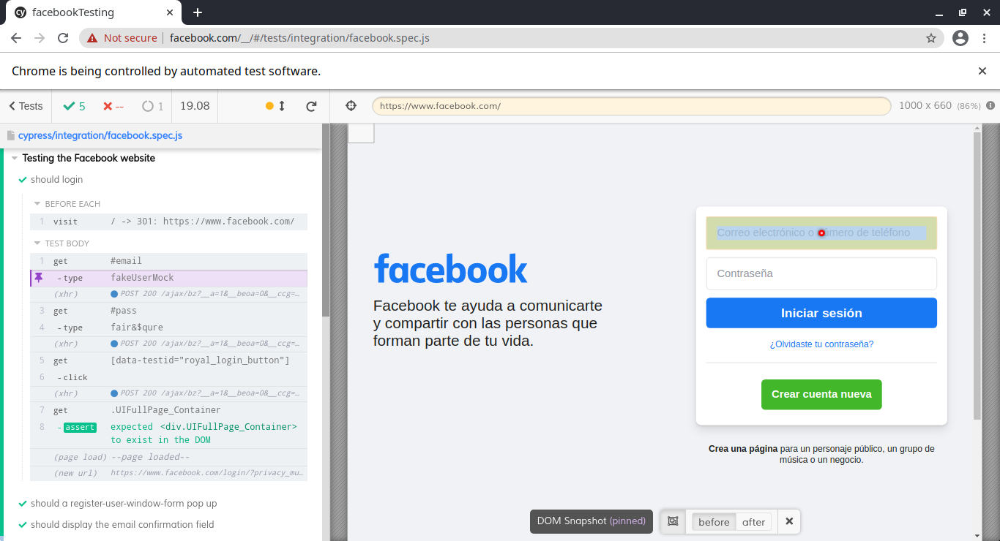

# testingFacebook

This is a brief example of testing using cypress to test the Facebook website

<div align="center">
    
</div>

## Installation
Once you clone the current repository, you may install all required dependencies by executing the following command at the root directory:

```npm install```

## Commmands
Then you may run:

```npm test```
